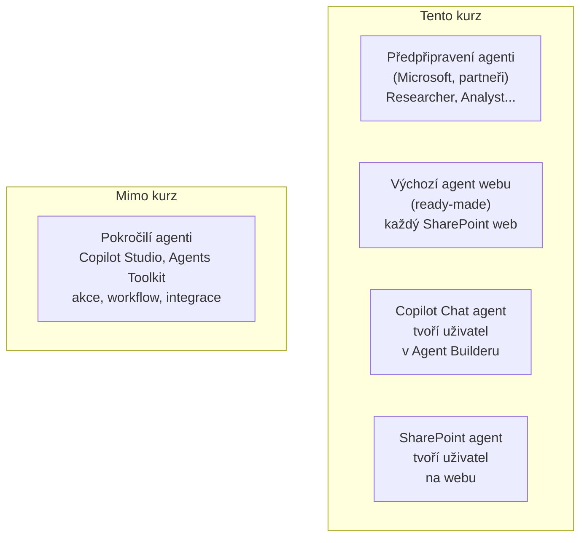

# M1 · Začínáme s agenty

> Typ: povinný · Odhad: 60 min · Slidy: LP1 deck, Modul 1 · Learn: [Get started with agents](https://learn.microsoft.com/en-us/training/paths/implement-no-code-copilot-agents-microsoft-365-sharepoint/)

## Cíle

- Rozlišíte **typy agentů** v Microsoft 365 Copilotu.
- Víte, **kdo může agenty tvořit a používat** — podle licence i podle oprávnění na SharePointu.
- Pojmenujete **přínosy** agentů a jejich **reálné hranice**.
- Rozumíte, proč firma potřebuje **governance** agentů a jak se vás týká.

## Co je agent

Agent = **AI asistent se specializací**. Běží na stejném Copilotu, ale má:

- **instrukce** — co dělá a jak odpovídá,
- **zdroje znalostí** — odkud čerpá (SharePoint, soubory, web),
- volitelně **schopnosti** — např. analýza dat pomocí kódu, generování obrázků.

Agent **nemá vlastní data ani vlastní práva**. Odpovídá vždy jen z toho, co smí vidět **ten, kdo se ptá**.

## Typy agentů

| Typ | Kdo tvoří | Kde žije | Příklad |
|---|---|---|---|
| **Předpřipravený** | Microsoft / partner | Agent Store | Researcher připraví rešerši z pošty a dokumentů |
| **Výchozí agent webu** | automaticky | každý SharePoint web | „Co je nového na tomto webu?" |
| **Copilot Chat agent** | vy | Copilot Chat, Teams | Asistent pro cestovní směrnici |
| **SharePoint agent** | vy (Edit na webu) | konkrétní SharePoint web | FAQ agent nad knihovnou postupů |
| **Pokročilý** | maker / vývojář | Copilot Studio, Toolkit | agent, který zakládá tikety v ServiceDesku |

> [!IMPORTANT] Slidy vs. realita
> Speaker notes MS decku tvrdí, že agenti pro běžné uživatele „neobsahují generativní AI". **To neplatí** — všichni agenti v kurzu generují odpovědi stejným jazykovým modelem jako Copilot. Rozdíl oproti pokročilým agentům je v **akcích a integracích** (zápis do systémů, workflow), ne v generativní AI.

### Deklarativní agenti — srovnání

Všichni agenti, které v kurzu tvoříte, jsou technicky **deklarativní agenti** (*declarative agents*): agent je jen **konfigurace** — instrukce, zdroje znalostí, schopnosti (u pokročilých i akce) — a odpovědi generuje **model a orchestrátor Microsoft 365 Copilotu**. Opakem je **custom engine agent** s vlastním modelem a orchestrací (Copilot Studio, Microsoft 365 Agents SDK, Azure AI Foundry) — mimo kurz.

Deklarativní agenty lze postavit ve čtyřech nástrojích. Liší se tím, **odkud agent čerpá**, **jestli umí akce** a **jak se dostane k uživatelům**:

| | **Agent Builder** (Copilot Chat agent) | **SharePoint agent** | **Copilot Studio** | **Agents Toolkit** (VS Code) |
|---|---|---|---|---|
| Kdo tvoří | kdokoli, bez kódu | Member / Owner webu, bez kódu | maker, low-code | vývojář, JSON manifest |
| Zdroje znalostí | web, SharePoint (weby, knihovny, soubory), nahrané soubory, e-mail a Teams chaty, Copilot konektory | **jen obsah SharePointu** (weby, knihovny, složky, soubory; max 20 zdrojů) | jako Agent Builder + Dataverse a další zdroje Power Platform | SharePoint, web, Copilot konektory, vložené soubory |
| Schopnosti | Code interpreter, Image generator | — | Code interpreter, Image generator | Code interpreter, Image generator |
| **Akce** (zápis do systémů) | ❌ | ❌ | ✅ konektory, Power Automate flows, REST API | ✅ API pluginy (OpenAPI), MCP servery |
| Kde je definice | v Copilot appce u autora | soubor **`.agent`** v knihovně webu | prostředí Power Platform | zdrojový kód (Git) → balíček aplikace |
| Sdílení | odkazem: jen já / vybraní lidé / celá organizace | odkazem, do Teams chatu; Owner **schválí** a může nastavit jako výchozí | publikace do Microsoft 365 Copilot a Teams | nasazení balíčku |
| Schválení pro celou firmu | admin v Microsoft 365 admin center | Owner webu (v rámci webu) | admin v Microsoft 365 admin center | admin v Microsoft 365 admin center |
| V kurzu | ✅ | ✅ | jen zmínka | ❌ |

**Co mají společné:** stejný jazykový model, **respektují oprávnění tazatele**, instrukce + zdroje znalostí + navržené dotazy. Rozhodnutí mezi nimi je proto hlavně o **rozsahu zdrojů** (jeden web vs. cokoli) a o **potřebě akcí**.

> [!TIP] Kterým nástrojem začít
>
> - Odpovědi jen nad obsahem **jednoho webu / knihovny** → **SharePoint agent**.
> - Kombinace zdrojů (více webů, soubory, web, e-mail) → **Agent Builder**.
> - Agent má něco **zapsat, založit nebo spustit** → Copilot Studio (maker) nebo Agents Toolkit (vývojář) — předejte IT.

## Kdo může agenty tvořit a používat

### Podle licence

| | Copilot Chat (zdarma) | Microsoft 365 Copilot (licence) |
|---|---|---|
| Chat s webem | ✅ | ✅ |
| Práce s firemními daty (SharePoint, OneDrive, Teams) | jen s **pay-as-you-go** (Copilot Credits, platí firma) | ✅ v ceně licence |
| Tvorba agentů | ✅ | ✅ |
| Agent nad firemními daty | jen s PAYG | ✅ |

Firmy licence **mixují**: plnou licenci dostanou lidé, kteří s Copilotem pracují denně, ostatní jedou Copilot Chat + PAYG.

### Podle oprávnění na SharePointu

| Role na webu | SharePoint agenty |
|---|---|
| **Owner** | tvoří, **schvaluje**, nastavuje výchozího agenta webu |
| **Member** (Edit) | tvoří |
| **Visitor** (Read) | jen používá sdílené agenty |
| **Externí uživatel (host)** | obvykle jako Visitor; jako Member jen když ho tak web přidá |

## Přínosy — a poctivé hranice

| Přínos | Co reálně umí | Co **neumí** (to je práce pro pokročilé agenty / Power Automate) |
|---|---|---|
| Rychlejší hledání | najde a shrne relevantní dokumenty, i bez přesných klíčových slov | nezaručí úplný výčet („vypiš **všechny** smlouvy…") |
| Zjednodušení úkolů | návrh metadat, shrnutí, koncept e-mailu | sám nic nezapíše, nepřesune, neoznačí |
| Spolupráce | jednotné odpovědi pro celý tým, sdílení do Teams | sám neposílá upozornění při změně dokumentu |
| Personalizace | odpovídá podle kontextu a instrukcí | — |
| Bezpečnost a compliance | **respektuje oprávnění** — nikdy neukáže víc | nehlídá přístupy, neposílá bezpečnostní alerty (to je Microsoft Purview) |

> [!IMPORTANT] Slidy vs. realita
> Poznámky ke slidům 10–11 uvádějí příklady jako „agent upozorní tým na změny v dokumentu v reálném čase" nebo „upozorní vedoucího na nepovolený přístup". Agent vytvořený v Agent Builderu nebo na SharePointu **tohle neumí** — odpovídá na dotazy. Upozornění = Power Automate, hlídání přístupů = Microsoft Purview / SharePoint Advanced Management.

## Governance — proč vás to jako tvůrce zajímá

Agenta tvoříte vy, ale **odpovědnost za data nese firma**. Proto IT nastavuje pravidla:

- **Kdo smí** tvořit a sdílet agenty (admin může tvorbu omezit).
- **Které agenty** jsou v Agent Store povolené.
- **Schvalování** — SharePoint agenty schvaluje vlastník webu; agenty pro celou firmu admin.
- **Kvalita** — pravidelná revize: odpovídá agent stále správně? Jsou zdroje aktuální?

Pro Česko konkrétně: **GDPR** (osobní údaje ve zdrojích agenta), u regulovaných firem **NIS2** / **DORA** (evidence a řízení nástrojů), interní ISMS (ISO 27001).

> [!TIP] Pravidlo pro tvůrce
> Než přidáte zdroj do agenta, zeptejte se: *„Měli by tenhle dokument vidět všichni, se kterými agenta budu sdílet?"* Agent sice práva nepřekročí — ale špatně nastavená práva na webu **zviditelní** rychleji než dřív.

## Diskuse

Otázky jsou v [`instructor-notes.md`](instructor-notes.md) — lektor je promítne.

## Stav produktu / delta

> [!WARNING] Ověřit k datu běhu — stav k 2026-09.
> Licenční split Copilot Chat / PAYG / licence a výchozí chování ready-made agentů se mění. Plná tabulka schopností je v Learn jednotce „Agents and Access in Microsoft 365 Copilot".
> Srovnání deklarativních agentů: ověřit dostupné zdroje znalostí v Agent Builderu (e-mail, Teams chaty, konektory), limit 20 zdrojů u SharePoint agenta a možnosti sdílení — viz [Declarative agents overview](https://learn.microsoft.com/en-us/microsoft-365-copilot/extensibility/overview-declarative-agent).
