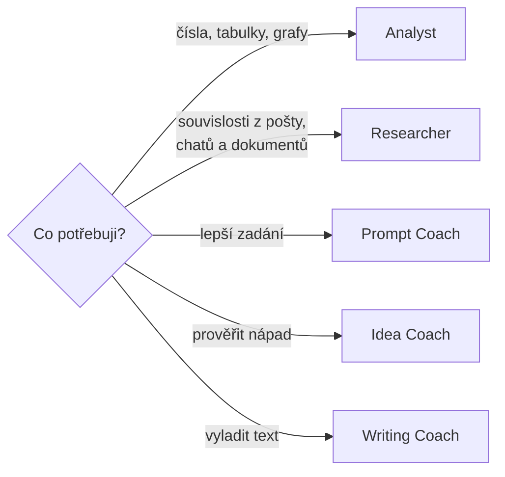

# M2 · Předpřipravení agenti v Microsoft 365 Copilotu

> Typ: povinný · Odhad: 90 min (3 laby à ~20 min) · Slidy: LP1 deck, Modul 2

## Cíle

- Víte, co umí klíčoví předpřipravení agenti a **kdy kterého použít**.
- Použijete **Analyst** na analýzu dat a **Researcher** na rešerši z vlastních dat.
- Napíšete prompt, který agentovi řekne **cíl, kontext, očekávání a zdroj**.

## Předpřipravení agenti

Nic se nekonfiguruje — agenta otevřete v Copilotu (**Agents** → **All agents** / **Agent Store**) a píšete běžnou řečí.

| Agent | Na co | Typický dotaz |
|---|---|---|
| **Analyst** | analýza dat v Excelu, Wordu, Power BI; spouští **Python** a ukáže kód | „Jaké jsou 3 hlavní trendy v této tabulce? Udělej graf." |
| **Researcher** | vícekroková rešerše napříč poštou, Teams, dokumenty a (pokud povoleno) webem; **s citacemi** | „Shrň všechno k projektu X za posledních 90 dní." |
| **Prompt Coach** | pomůže napsat lepší prompt | „Tenhle prompt mi nedává dobré výsledky — přepiš ho." |
| **Idea Coach** | sparring partner: rozvíjí a **zpochybňuje** nápady | „Najdi slabá místa v tomto plánu." |
| **Writing Coach** | text: struktura, tón, srozumitelnost | „Přepiš tento e-mail tak, aby byl stručnější a zdvořilejší." |

> [!WARNING] Ověřit k datu běhu — stav k 2026-09.
> Sortiment agentů se mění (Visual Creator byl 10/2025 nahrazen funkcí **Copilot Create**). **Researcher a Analyst** jsou součástí licence Microsoft 365 Copilot, mohou mít **měsíční limit dotazů** a Analyst nepodporuje všechny jazyky. Rozhoduje, zda agenta vidíte v Agent Store — viz [pre-course check](../course-intro/pre-course-check.md) a [`../GLOSSARY.md`](../GLOSSARY.md). V Agent Store najdete i další agenty od Microsoftu a partnerů.

### Analyst vs. Researcher — kdy kterého

- **Analyst** pracuje s **daty** (počítá, filtruje, kreslí grafy). Kód, který spouští, si můžete zobrazit a zkontrolovat.
- **Researcher** pracuje s **informacemi** (hledá, propojuje, shrnuje). Postupuje metodicky, proto odpovídá **déle** (i minuty) a **dlouze** (klidně 8–10 stran).

> [!TIP] Researcher je upovídaný
> Po dlouhé odpovědi navažte: *„Shrň to do 5 odrážek."* nebo *„Co z toho je akční bod pro mě?"*

## Anatomie dobrého promptu

Platí pro všechny agenty — povinný je jen cíl, ostatní části výrazně zlepší výsledek.

| Část | Otázka | Příklad |
|---|---|---|
| **Cíl** | Co chci? | „Shrň výsledky průzkumu…" |
| **Kontext** | Proč a pro koho? | „…pro vedení, které rozhoduje o pokračování projektu…" |
| **Očekávání** | Jaký výstup? | „…jako 5 odrážek česky a jeden graf…" |
| **Zdroj** | Z čeho? | „…z přiloženého souboru Project Nexus." |

Promptování je **iterace**: první odpověď je začátek konverzace. A výstupy **ověřujte** — AI se může mýlit, zvlášť u čísel.

## Laby

| Lab | Odhad | Soubor |
|---|---|---|
| 1 · Analyst — průzkum Project Nexus | 20 min | [`lab-analyst.md`](lab-analyst.md) |
| 2 · Researcher — rešerše z vlastních dat | 20 min | [`lab-researcher.md`](lab-researcher.md) |
| 3 · Agent dle výběru | 20 min | [`lab-agent-choice.md`](lab-agent-choice.md) |

## Stav produktu / delta

> [!WARNING] Ověřit k datu běhu — stav k 2026-09.
> Dostupnost Researcher/Analyst podle licence, názvy agentů (Writing agent vs. Writing Coach), umístění v UI (Agents / Agent Store / More agents).
