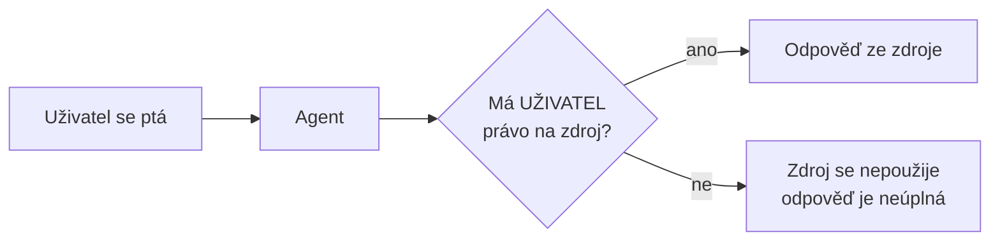

# M4 · Sdílení a používání agentů

> Typ: povinný · Odhad: 45 min · Slidy: LP1 deck, Modul 4

## Cíle

- Nasdílíte agenta **správné skupině** — v Copilot Chatu i na SharePointu.
- Víte, proč sdílení agenta **nesdílí automaticky jeho zdroje** (s jednou výjimkou).
- Použijete agenta v **Microsoft Teams**.
- Umíte pracovat s **historií konverzací** a víte, co agent (ne)vidí.

## Sdílení — dva různé modely

| | **Copilot Chat agent** | **SharePoint agent** |
|---|---|---|
| Kdo sdílí | **tvůrce sám** | tvůrce **nemůže** — agenta **schvaluje vlastník webu** |
| Možnosti | **Only you** (výchozí) · **Specific users** (bezpečnostní skupiny) · **Anyone in your organization** | po schválení je dostupný členům / návštěvníkům webu |
| Vlastník webu tvoří sám | — | agent je **schválený automaticky** |
| Mohou příjemci upravovat? | ne | ne |
| Příjemci potřebují | licenci Microsoft 365 | licenci Microsoft 365 |

## Nejdůležitější pravidlo modulu

- Agent odpovídá **podle oprávnění toho, kdo se ptá** — ne podle oprávnění tvůrce.
- Sdílením agenta **se nemění** oprávnění na webech, stránkách a souborech. Když kolegové nemají přístup ke zdrojům, agent jim z nich neodpoví → **musíte upravit oprávnění zdrojů**.
- **Výjimka:** u Copilot Chat agenta se zdroji typu **soubor / složka** se při sdílení tyto soubory **nasdílí automaticky**. Celé **weby** se automaticky nesdílí nikdy.
- Proto Microsoft doporučuje sdílet přes **bezpečnostní skupiny** — přístup k agentovi i ke zdrojům řídíte na jednom místě.
- Když někomu odeberete přístup k agentovi, **neodeberete mu tím přístup** k nasdíleným souborům.

> [!WARNING] Sdílíte agenta = sdílíte obsah
> Než agenta se soubory nasdílíte „Anyone in your organization", zkontrolujte, co v souborech je. Automatické nasdílení souborů je pohodlné — a stejně snadno zveřejní dokument, který být veřejný neměl.

## Agenti v Microsoft Teams

- Z Copilot Chatu i ze SharePointu získáte **odkaz na agenta** a vložíte ho do chatu nebo kanálu v Teams (nebo jiné M365 aplikace).
- V chatu/kanálu agenta vyvoláte **@zmínkou**.
- Platí stejné pravidlo: každý dostane odpověď jen ze zdrojů, na které má právo.

Kde to dává smysl: onboarding nováčků v týmovém kanálu, projektové dotazy („jaký je stav?"), FAQ k interním procesům, příprava na poradu.

## Používání agentů — co vědět

- Agent čerpá jen ze **zdrojů, které má nastavené** a ke kterým **vy máte přístup**. Neúplná odpověď → možná nemáte práva; obraťte se na vlastníka webu.
- **Hub web** jako zdroj → agent čerpá i z přidružených webů.
- Stránky z knihovny **Site Pages** podle slidů jako zdroj přidat nejde — ověřte v UI.
- Do konverzace můžete odkázat soubory: DOC(X), PPT(X), XLSX, PDF, TXT, RTF, ODT, ODP, HTML/ASPX, Loop/Fluid.

> [!IMPORTANT] Slidy vs. realita
> Slide 50 uvádí, že agenti nepoužívají SharePoint listy. **Zastaralé** — od 2026 list jako (jediný) zdroj funguje. Viz [M3](../build-manage-agents/README.md#součásti-agenta).

### Historie konverzací

- Vaše konverzace s agenty vidíte **jen vy**.
- Konverzaci můžete **přejmenovat**, **smazat** jednu nebo **všechny**.
- Když otevřete starou konverzaci, přepne se i agent, se kterým jste ji vedli.

## Mini-lab: sdílení a test hranice práv (10 min)

> [!IMPORTANT] Jen v rámci jedné firmy
> Agenta lze sdílet **jen uvnitř vlastního tenantu**. Spolužákovi z jiné firmy ho nenasdílíte — sdílecí dialog ho ani nenajde.

**Varianta A — dvojice ze stejné firmy**

1. Nasdílejte svého Copilot Chat agenta z M3 kolegovi (**Specific users** nebo odkazem).
2. Kolega položí váš test č. 5 (hranice práv) z M3 — a jeden běžný dotaz.
3. Dostal odpověď ze zdroje, na který **nemá** práva? (Neměl by.)
4. Změňte něco na agentovi. Vidí kolega změnu hned, nebo až po novém nasdílení?

**Varianta B — jste z firmy sami**

1. Otevřete sdílecí dialog svého agenta a projděte volby (**Only you** / **Specific users** / **Anyone in your organization**) — **nic neukládejte**.
2. Zapište si: *komu* agenta ve firmě nasdílíte, *přes jakou skupinu*, a *mají ti lidé přístup ke všem zdrojům agenta?*
3. Zapište **predikci** testu č. 5: co odpoví kolegovi bez přístupu ke zdroji?
4. Test udělejte **zítra s kolegou v práci**.

Lektor ukáže celý test živě na svém tenantu se dvěma účty.

## Stav produktu / delta

> [!WARNING] Ověřit k datu běhu — stav k 2026-09.
> Možnosti sdílení (Anyone / Specific users / Only you), schvalovací flow SharePoint agentů, chování úprav sdíleného agenta v Teams, podpora Site Pages jako zdroje.
